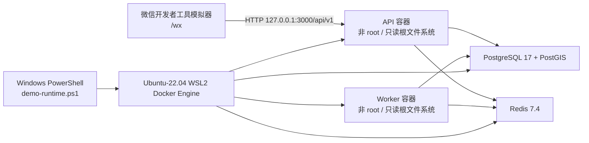

# Stay Fable Demo v0.1 设计

## 目标

在 `dev` 基线上交付第一版可重复运行的酒店预订 Demo。Demo 必须同时具备：

- 可在 Windows 微信开发者工具模拟器中打开的原生小程序 `/wx`；
- 在 Ubuntu-22.04 WSL2 Docker Engine 中运行的 PostgreSQL/PostGIS、Redis、API 和 Worker；
- 自动迁移和初始化的演示数据；
- 从酒店列表、酒店详情、房型详情、报价、下单、模拟支付到订单查询/取消的演示闭环；
- 可审计的一键启动、状态检查、停止和部署文档；
- 通过验证后位于 `dev`，并以注释标签 `demo-v0.1.0` 标记。

`release` 和 `main` 不属于本次变更范围。当前 Swagger 依赖链仍有一个已记录的 High
级漏洞，因此它们继续受发布门禁阻断。

## 版本与分支

现有 `codex/wx-mvp-booking-design` 以快进方式合入 `dev`。Demo 的新增工作从该
`dev` 基线建立 `codex/demo-v0.1`，完成全部验收后再快进合入 `dev`。

标签 `demo-v0.1.0` 只在最终 `dev` 提交上创建。根包和内部 workspace 包继续保持
私有 `0.0.0`，避免把演示里程碑误表达为可发布的 npm 包版本。

## 运行架构



微信开发版继续使用现有安全默认值：

- API：`http://127.0.0.1:3000/api/v1`；
- 身份：`mock`；
- 支付：后端只在 Demo 环境显式启用模拟支付；
- 非 develop 环境仍要求 HTTPS 和真实微信身份，不因 Demo 放宽。

## Demo 生命周期

统一入口为 `scripts/demo-runtime.ps1`：

```powershell
pwsh -File scripts/demo-runtime.ps1 -Action Up
pwsh -File scripts/demo-runtime.ps1 -Action Status
pwsh -File scripts/demo-runtime.ps1 -Action Down
```

PowerShell 负责 Windows/WSL 边界、工作区校验、Node 构建产物、Prisma
迁移和数据初始化；`scripts/demo-runtime.sh` 只负责 WSL Docker 资源。

### Up

1. 确认命令在当前 linked worktree 根目录执行。
2. 检查 Ubuntu-22.04、Docker Engine、Node 24、pnpm 11 和端口 3000。
3. 创建带随机 owner token 的 `.demo-runtime`，拒绝接管已有目录。
4. 生成 Prisma Client，构建 workspace，并分别生成 API/Worker 生产部署产物。
5. 使用独立 Compose 项目 `stay-fable-demo` 启动 PostGIS 和 Redis；默认宿主端口为
   `55432`、`56379`，不影响其他项目容器。
6. 从 Windows workspace 对 Demo 数据库执行 `prisma migrate deploy` 和确定性 seed。
   seed 日期以 Asia/Shanghai 当日为目录供应起点，保证模拟器当天可查询。
7. 在 Demo Compose 网络中启动 API 和 Worker 容器。两个容器均：
   - 使用固定摘要的 Node 24 镜像；
   - 以 `node` 用户运行；
   - 根文件系统只读；
   - 删除全部 Linux capabilities；
   - 启用 `no-new-privileges`；
   - 只挂载只读部署产物，并提供独立 `/tmp` tmpfs。
8. 将 API 绑定到 `127.0.0.1:3000`，等待 `/health/live` 和 `/health/ready` 成功。
9. 输出固定的 `STAY_FABLE_DEMO_READY` 标记和微信项目路径。

### Status

状态检查只读取带 Demo 标签的资源，并验证：

- PostGIS、Redis、API、Worker 均存在；
- API/Worker owner token 与 `.demo-runtime` 标记一致；
- API 和 Worker 的容器用户不是 root；
- API 和 Worker 的根文件系统为只读；
- API liveness/readiness 均返回成功；
- Worker 正在运行且重启次数为 0。

任一条件失败时返回非零退出码，避免显示“部分可用”的错误成功状态。

### Down

停止流程先核对 owner token，只删除：

- `stay-fable-demo-api`；
- `stay-fable-demo-worker`；
- `stay-fable-demo` Compose 项目的容器和网络；
- 当前 worktree 自己拥有的 `.demo-runtime`。

Compose 数据卷默认保留，便于下次快速演示。脚本不停止、不删除任何无 Demo
标签的容器，也不使用 `docker system prune`。

## 文件边界

- `scripts/demo-runtime.ps1`：Windows 入口、构建、迁移、seed、动作分派。
- `scripts/demo-runtime.sh`：WSL Docker 生命周期和资源所有权防护。
- `scripts/demo-runtime.test.mjs`：脚本、端口、安全配置和清理边界的静态契约测试。
- `package.json`：提供 `demo:up`、`demo:status`、`demo:down` 快捷命令。
- `docs/operations/demo-v0.1-deployment.md`：从零部署、演示步骤、故障排查和停止方法。
- `docs/verification/2026-07-31-demo-v0.1.md`：记录最终提交、验证命令、结果和已知漏洞。

不新增管理后台功能，不恢复冻结的 Taro 客户端，不接入真实微信支付或生产微信登录。

## 验证与验收

### 代码门禁

- `pnpm verify`
- `pnpm wx:check`
- `pnpm format:check`
- `pnpm lint`
- `pnpm typecheck`
- `pnpm test`
- `pnpm build`
- `pnpm audit --audit-level high`
- `pnpm --prod audit --audit-level high`

dev 阶段漏洞只报告。验证文档必须明确记录 Swagger → js-yaml 的剩余 High 项，
不得把非零审计退出码描述为通过。

### WSL2 后端

- 执行 `demo:up`；
- 检查 liveness/readiness；
- 验证 PostGIS 扩展与 Redis PONG；
- 验证迁移、seed、登录、目录、报价、下单、支付、订单和取消接口；
- 连续观察 Worker 至少 10 分钟，重启次数为 0 且无重连循环；
- 执行 `demo:status`；
- 最终执行 `demo:down`，保留数据卷且不影响无关容器。

### 微信模拟器

使用 wechatide 工作流打开 `/wx`，完成：

1. 微信开发者工具正式编译；
2. 模拟器加载首页并从 `127.0.0.1:3000` 获取真实 Demo 数据；
3. 选择城市和日期；
4. 进入酒店列表，再进入酒店详情和房型详情；
5. 生成报价并创建订单；
6. 先模拟支付失败，再重试成功；
7. 在订单列表和详情中看到已确认状态；
8. 使用另一笔订单验证取消；
9. 保存编译结果、关键截图和自动化结果。

只有上述验证均有本次提交的新鲜证据时，才能创建 `demo-v0.1.0` 标签。

## 文档与运维约束

部署文档以新环境为读者，不依赖历史对话。文档必须包含依赖版本、首次安装、
启动命令、预期成功标记、微信项目导入路径、开发者工具设置、完整演示路径、
状态检查、数据重置选择、停止方法、端口冲突处理和已知限制。

“重置数据”必须作为显式的人工维护步骤，不并入默认 `Down`；任何删除卷的命令都要
精确限定 `stay-fable-demo` 项目并在文档中标注会丢失 Demo 数据。
